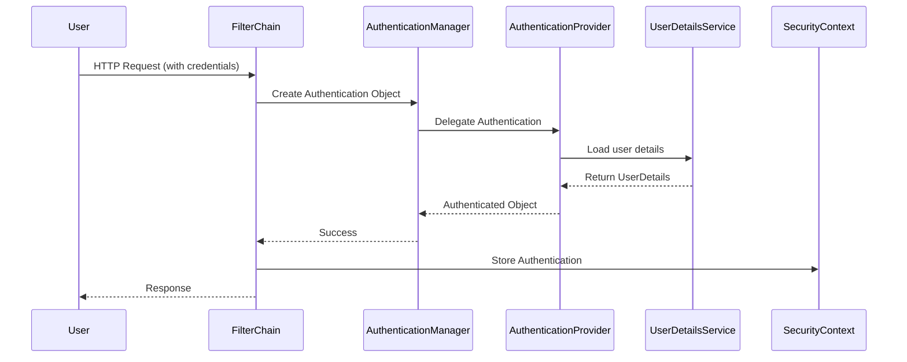
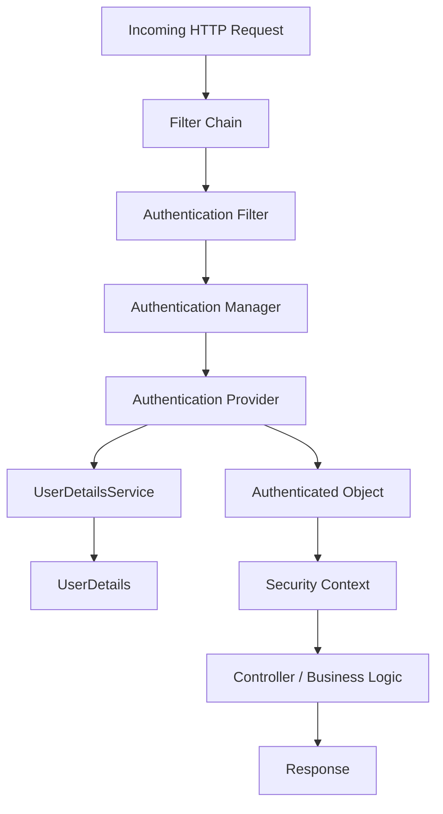

## Overview - What is Spring Security?

Spring Security is a powerful framework that focuses on:

* **Authentication** → Who are you?
* **Authorization** → What are you allowed to do?
* Protection against common attacks like **CSRF**, **Session Fixation**, etc.

It integrates seamlessly with Spring-based applications.

---

## Key Components

1. **AuthenticationManager**

   * Core strategy interface for authentication.
   * Has `authenticate()` method → takes `Authentication` object, returns authenticated `Authentication`.

2. **AuthenticationProvider**

   * Knows how to perform specific authentication.
   * Example: Username/Password authentication provider.

3. **UserDetailsService**

   * Loads user-specific data.
   * Returns a `UserDetails` object (contains username, password, roles, etc.).

4. **SecurityContext**

   * Stores authentication details of the currently authenticated user.

---

## Spring Security Flow (Simplified)



---

## Important Filters

* **UsernamePasswordAuthenticationFilter** → handles form login.
* **BasicAuthenticationFilter** → handles HTTP Basic Auth.
* **BearerTokenAuthenticationFilter** → handles JWT/OAuth2.

Each request goes through a **Filter Chain**.

---

## Security Configuration (Java-based)

### Example:

```java
@Configuration
@EnableWebSecurity
public class SecurityConfig {

    @Bean
    public SecurityFilterChain securityFilterChain(HttpSecurity http) throws Exception {
        http
            .authorizeHttpRequests(auth -> auth
                .requestMatchers("/public/**").permitAll()
                .anyRequest().authenticated()
            )
            .formLogin(withDefaults());
        return http.build();
    }

    @Bean
    public UserDetailsService userDetailsService() {
        UserDetails user = User.withDefaultPasswordEncoder()
                .username("user")
                .password("password")
                .roles("USER")
                .build();
        return new InMemoryUserDetailsManager(user);
    }
}
```

### Explanation:

* `/public/**` is accessible to everyone.
* All other endpoints require authentication.
* In-memory user store is defined for demo purposes.

---

## Authentication vs Authorization

* **Authentication** → Validating identity (e.g., username + password).
* **Authorization** → Deciding access rights based on roles/permissions.

---

## Example Scenario

1. User sends request with username/password.
2. `UsernamePasswordAuthenticationFilter` intercepts it.
3. Creates `UsernamePasswordAuthenticationToken`.
4. Passes to `AuthenticationManager`.
5. Manager delegates to `AuthenticationProvider`.
6. Provider calls `UserDetailsService` to load user.
7. If valid → authentication success → store in `SecurityContextHolder`.
8. Else → authentication failure.

---

## SecurityContextHolder

* Holds the `SecurityContext` (thread-local).
* Accessible anywhere in code via:

```java
Authentication auth = SecurityContextHolder.getContext().getAuthentication();
```

---

## Diagram – Filter Chain Overview



---

## Key Takeaways

* Spring Security uses a **filter chain** for request processing.
* **AuthenticationManager** delegates authentication to multiple providers.
* **UserDetailsService** provides user data.
* Once authenticated, user info is stored in `SecurityContextHolder`.
* Supports different authentication mechanisms (Form, Basic, JWT, OAuth2, etc.).
