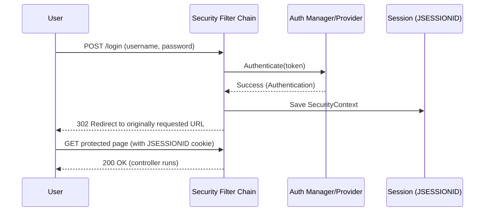

# Spring Security: Users, Roles & Passwords

**Focus:** how users are represented, how roles/authorities work, how to create users (in‑memory), and how passwords are handled.

---

## 0) Goal & Mental Model

* Add **users** to the app.
* Protect URLs using **roles/authorities**.
* Store users **in memory** for now (good for learning/testing).
* Use a proper **password encoder** (BCrypt) and know the quick dev shortcut (`{noop}`).

**Big picture**

```
Login form / HTTP Basic
        ↓
Creates Authentication (username+password)
        ↓
AuthenticationManager → AuthenticationProvider
        ↓
UserDetailsService / UserDetailsManager → loads user
        ↓
Compare password with PasswordEncoder → success/failure
        ↓
On success: SecurityContextHolder stores Authentication (via session)
```

---

## 1) Core Concepts

### 1.1 `UserDetails`


Represents one user. Key parts:

* `getUsername()`
* `getPassword()` (encoded)
* `getAuthorities()` → a `Collection<GrantedAuthority>`
* Account flags: `isAccountNonExpired()`, `isAccountNonLocked()`, `isCredentialsNonExpired()`, `isEnabled()`

I can either **implement `UserDetails`** myself or use the built‑in **`org.springframework.security.core.userdetails.User`**.


### 1.2 Authorities vs Roles

* **Authority**: any string like `"READ_REPORTS"`, `"ROLE_ADMIN"`.
* **Role**: a special authority that **conventionally starts with `ROLE_`**.

**Important rule:**

* `hasRole("ADMIN")` under the hood checks for authority `"ROLE_ADMIN"`.
* `hasAuthority("ROLE_ADMIN")` checks exactly that string.

So either write:

```java
httpSecurity.authorizeHttpRequests()
  .requestMatchers("/admin/**").hasRole("ADMIN")  // adds ROLE_ automatically
  .requestMatchers("/reports/**").hasAuthority("READ_REPORTS")
  .anyRequest().authenticated();
```

### 1.3 `GrantedAuthority` & `SimpleGrantedAuthority`

* One user can have many authorities.
* `SimpleGrantedAuthority("ROLE_USER")` or `new SimpleGrantedAuthority("READ_REPORTS")`.


### 1.4 `UserDetailsService` vs `UserDetailsManager`

* `UserDetailsService` → **read‑only**: `loadUserByUsername()`
* `UserDetailsManager` → read + **CRUD** (create/update/delete users)

  * **`InMemoryUserDetailsManager`** is the in‑memory implementation (perfect for today).
 


When we try to login,


### 1.5 Password encoding

* **Never store plain text** in real apps.
* Use `BCryptPasswordEncoder` (production‑safe choice).
* For quick dev/testing: `{noop}` (or `NoOpPasswordEncoder`), but **never** for prod.


We'll try to login again,


---

## 2) Minimal Working Setup (in‑memory users). 

**We can use builder pattern to create User.**

We’ll define:

1. a `PasswordEncoder`
2. a `UserDetailsService` / `UserDetailsManager` bean with users
3. authorization rules in `SecurityFilterChain` (optional as of now)

```java
// src/main/java/com/example/security/SecurityConfig.java
package com.example.security;

import org.springframework.context.annotation.*;
import org.springframework.security.config.annotation.web.builders.HttpSecurity;
import org.springframework.security.config.annotation.web.configuration.EnableWebSecurity;
import org.springframework.security.core.userdetails.User;
import org.springframework.security.core.userdetails.UserDetails;
import org.springframework.security.provisioning.InMemoryUserDetailsManager;
import org.springframework.security.core.userdetails.UserDetailsService;
import org.springframework.security.crypto.bcrypt.BCryptPasswordEncoder;
import org.springframework.security.crypto.password.PasswordEncoder;
import org.springframework.security.web.SecurityFilterChain;

@Configuration
@EnableWebSecurity
public class SecurityConfig {

  // 1) Password encoder (BCrypt)
  @Bean
  public PasswordEncoder passwordEncoder() {
    return new BCryptPasswordEncoder();
  }

  // 2) Users (in-memory)
  @Bean
  public UserDetailsService userDetailsService(PasswordEncoder encoder) {
    UserDetails user = User.builder()
        .username("user")
        .password(encoder.encode("user123"))
        .roles("USER")              // becomes authority ROLE_USER
        .build();

    UserDetails admin = User.builder()
        .username("admin")
        .password(encoder.encode("admin123"))
        .roles("ADMIN", "USER")     // ROLE_ADMIN + ROLE_USER
        .authorities("READ_REPORTS") // extra fine-grained authority
        .build();

    return new InMemoryUserDetailsManager(user, admin);
  }

  // 3) Authorization rules + login
  @Bean
  public SecurityFilterChain securityFilterChain(HttpSecurity httpSecurity) throws Exception {
    httpSecurity
      .authorizeHttpRequests()
        .requestMatchers("/", "/public/**").permitAll()
        .requestMatchers("/admin/**").hasRole("ADMIN")
        .requestMatchers("/reports/**").hasAuthority("READ_REPORTS")
        .anyRequest().authenticated();
    httpSecurity.formLogin()       // default login page
    httpSecurity.httpBasic();      // enable Basic for curl/testing

    return http.build();
  }
}
```

---

## 3) Dev shortcut: `{noop}` (only for learning!)

If I don’t want to configure a real encoder yet:

```java
@Bean
public UserDetailsService userDetailsService() {
  UserDetails demo = User.withUsername("demo")
    .password("{noop}demo123")   // ← plain text for quick tests ONLY
    .roles("USER")
    .build();
  return new InMemoryUserDetailsManager(demo);
}
```

**Common error:** `There is no PasswordEncoder mapped for the id "null"` → Happens when the password **doesn’t** have a prefix like `{noop}`, `{bcrypt}`, and no encoder is configured. Fix by either:

* Using `{noop}plainPassword` **or**
* Defining a `PasswordEncoder` and using `encoder.encode("password")`.

---

## 4) URL Authorization Examples (roles vs authorities)

```java
httpSecurity.authorizeHttpRequests()
  .requestMatchers("/profile/**").hasAnyRole("USER", "ADMIN")
  .requestMatchers("/manage/**").hasAuthority("ROLE_ADMIN")  // explicit authority
  .requestMatchers("/ops/**").hasAnyAuthority("DEPLOY", "ROLLBACK")
  .anyRequest().authenticated();
```

**Cheat sheet**

* `hasRole("ADMIN")` ⇢ expects authority `ROLE_ADMIN`.
* `hasAuthority("ROLE_ADMIN")` ⇢ checks the exact string.
* Prefer roles for broad access, authorities for finer permissions.

---

## 5) What happens after login (session basics)

After success, Spring Security stores the `Authentication` in the **session** so we don’t re‑login for each request.



> In modern Spring Security, the `SecurityContext` is associated with the HTTP session by default. Logging out invalidates it.

---

## 6) Troubleshooting (typical)

* **`There is no PasswordEncoder mapped for the id "null"`** → use `{noop}` for quick tests or configure a `PasswordEncoder` and encode passwords.
* **Can’t access admin URL even as admin** → check that you used `hasRole("ADMIN")` (not `hasAuthority("ADMIN")`), or ensure your user actually has `ROLE_ADMIN`.
* **Login always fails** → verify the username, encoded password, and that the same encoder is used both to store and to match.

---

## 7) Recap

* `UserDetails` models the user; `GrantedAuthority` models permissions.
* Roles are just authorities with `ROLE_` prefix; `hasRole("X")` ⇒ checks `ROLE_X`.
* Use `InMemoryUserDetailsManager` for quick starts.
* Prefer `BCryptPasswordEncoder` for real encoding; `{noop}` only for learning.
* After login, the session holds the `SecurityContext` so we stay authenticated.
